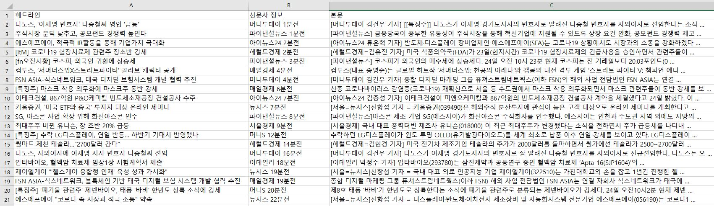

# StockNews
주식뉴스서비스

## Description
- 증권가 실시간 뉴스 파싱 및 정보 제공
- 데이터 분석을 통한 정보 제공
- 가장 관심도가 높은 종목 파악
- API를 통한 

## 개발 환경
- Python3.7
- selenium 3.141.0
- urllib3 1.25.10
- pandas 1.15.0 
- numpy 1.19.1

## Schedule
- [X]  KTOP 30, KOSPI, KOSPI200, KOSDAQ, KOSDAQ150, KRX300 가격 정보 파싱 [08.24]
- [X]  네이버 증권뉴스 속보 TOP 20 파싱 [08.24]
- [X]  뉴스헤드라인으로부터 해당하는 종목 인식[08.24]
- [ ]  뉴스에 종목 고유 인덱스 부여
- [ ]  종목별 해당하는 뉴스 분류기 웹서비스 구현
- [ ]  Machine Learning을 통한 Positive, Negative 내용 분석
- [ ]  분석된 긍정, 부정 뉴스를 통해 해당 종목에 투자 지수화
- [ ]  지수화 된 정보를 바탕으로 모의 투자 진행
- [ ]  웹사이트화, 서비스 제공
- [ ]  결과 평가

## Revision History
- [20.08.24] : 가격정보, 증권 뉴스 속보 파싱 (selenium), csv파일 저장

